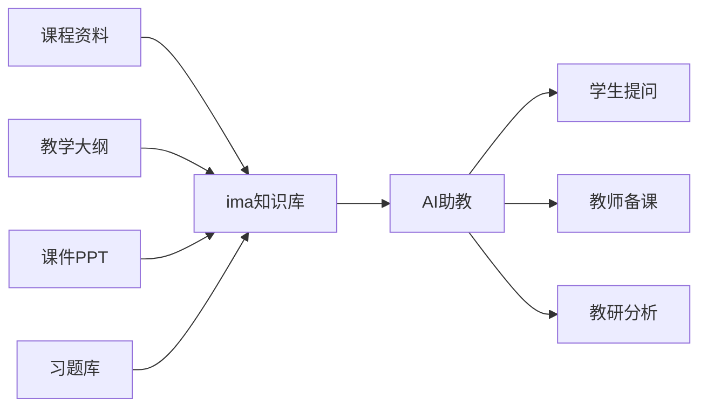

# AI赋能教学创新工作坊——职业院校教师版（2天完整课程）

> 本课程基于2024-2025年多期教师工作坊实战迭代，融合焦建利教授"五条路径"框架、熊建军讲师AIGC训练营体系、杨辉教练企业AI落地实践，更新至2026年最新AI技术生态。

---

## 课程概述

| 项目 | 内容 |
|------|------|
| **课程名称** | AI赋能教学创新工作坊（职业院校教师版） |
| **课程时长** | 2天（每天6小时教学+1小时实践） |
| **适用对象** | 职业院校院系领导、教务处/科研处负责人、专业带头人、骨干教师、教学资源库建设负责人 |
| **课程形式** | 理论讲授 + 实操演练 + 案例分析 + 分组研讨 + 成果产出 |
| **技术栈** | DeepSeek、Claude、文心一言、通义千问、Kimi、即梦AI、剪映、腾讯智影、ima知识库 |

### 课程背景

2026年，AI已从"辅助工具"进化为"教学合伙人"。教育部长怀进鹏强调"把人工智能技术深入教育教学全过程全环节"。对于职业院校而言：

- **岗位迭代加速**：AI正在重塑各行各业的工作方式，学生就业技能必须同步升级
- **教学模式变革**：从"知识传授"到"AI协同创造"，教师角色正在重新定义
- **政策强力驱动**：教育部"数字化赋能教师发展行动"要求教师具备数字素养
- **产教融合深化**：AI使校企合作从"实习对接"升级为"能力共育"

### 课程收益

完成本工作坊后，学员将能够：

1. ✅ 理解AIGC核心原理及教育应用场景
2. ✅ 掌握提示词工程，与AI高效对话
3. ✅ 用AI辅助教学设计、备课、出题、评改
4. ✅ 使用AI多模态工具（图文音视频）制作教学资源
5. ✅ 搭建个人AI教学助理和知识库
6. ✅ 用AI辅助课题申报与学术研究
7. ✅ 设计AI融合课程，培养学生AI素养
8. ✅ 获得可直接使用的AI教学工具包

---

## 第一天：AI工具力——从认知到上手

### 模块一：AI认知重启（9:00-10:30）

#### 1.1 AI时代的教师新角色

> **核心观点**：AI不是来替代教师的，而是重新定义了"好教师"的标准。未来的核心竞争力 = 教学能力 × AI协作能力。

**讨论：您眼中的AI是什么？**
- 工具？对手？助手？伙伴？
- 破冰练习：用AI一句话介绍自己的课程

#### 1.2 决策式AI vs 生成式AI

| 维度 | 决策式AI（判别式） | 生成式AI（AIGC） |
|------|-------------------|-----------------|
| 核心能力 | 分类、识别、预测 | 创造、生成、对话 |
| 典型应用 | 人脸识别、推荐系统、风控 | 文本生成、绘图、视频制作 |
| 教育场景 | 学情分析、作业批改 | 教案生成、课件制作、虚拟教师 |
| 代表技术 | CNN、RNN、推荐算法 | GPT、Diffusion、Sora |

**关键技术演进图谱：**

```
机器学习 → 深度学习 → 大语言模型(LLM) → 多模态大模型
  2010s        2015s         2022-2024          2025+
                                           ├── 文本：GPT-5、Claude 4、DeepSeek-V4
                                           ├── 图像：Midjourney V7、DALL-E 4
                                           ├── 视频：Sora、可灵AI、即梦
                                           ├── 代码：Claude Code、Cursor
                                           └── 语音：语音克隆、实时翻译
```

#### 1.3 AI教育应用的五个层次（参考焦建利教授框架）

| 层次 | 描述 | 示例 |
|------|------|------|
| L1 业务自动化 | AI处理重复性事务 | 作业批改、考勤统计、数据录入 |
| L2 智能助理 | AI协助教学准备 | 备课素材搜索、PPT生成、文献整理 |
| L3 学习顾问 | AI个性化辅导 | 自适应学习路径、智能问答 |
| L4 联合教学 | AI与教师协同授课 | 双师课堂、AI助教实时答疑 |
| L5 自适应学习 | AI自主优化教学策略 | 学情数据驱动教学迭代 |

> **💡 职业院校的突破口**：从L1+L2起步，聚焦"实训教学场景"的AI增强，逐步向L3-L5演进。实训课的AI赋能（虚拟仿真、AI评分、数字人讲师）是职业院校的独特优势。

#### 1.4 2026年AI工具生态全景

**💬 文本生成类（教学核心工具）**

| 工具 | 特色 | 推荐场景 | 费用 |
|------|------|----------|------|
| **DeepSeek** | 中文理解最强、推理深度好、免费 | 教案设计、出题、学情分析 | 免费 |
| **Claude 4 Sonnet** | 长文本支持200K、结构化输出强 | 课题申报、课程大纲设计 | $20/月 |
| **文心一言4.5** | 百度生态整合、知识图谱 | 教学资料搜索、PPT生成 | 免费/付费 |
| **通义千问2.5** | 阿里生态、PPT插件、音视频 | 多模态教学资源生成 | 免费 |
| **Kimi** | 超长上下文、联网搜索 | 文献综述、教案研究 | 免费 |

**🎨 图像与设计类**

| 工具 | 特色 | 推荐场景 |
|------|------|----------|
| 即梦AI（字节） | 中文提示词友好、国风效果佳 | 教学插图、课件配图 |
| 可灵AI（快手） | 视频生成效果领先 | 教学短视频、微课素材 |
| Midjourney V7 | 品质最高 | 封面图、专业设计 |
| 哩布哩布LiblibAI | SD模型社区、无需显卡 | 专业教学图生成 |

**🎬 视频/数字人类**

| 工具 | 功能 | 教学用途 |
|------|------|----------|
| 剪映 | AI剪辑+文字成片+数字人 | 微课制作、课程短视频 |
| 腾讯智影 | 数字人播报 | 虚拟教师出镜 |
| 可灵AI | 文生视频、图生视频 | 教学动画、情境演示 |
| D-ID | 照片转数字人口播 | 教师形象数字化 |

**🧠 知识库与AI助教**

| 工具 | 功能 | 教学用途 |
|------|------|----------|
| ima知识库（腾讯） | 个人/团队知识库+AI问答 | 课程知识库、AI助教 |
| 飞书文档+AI | 协作文档+智能问答 | 教研共享、学情分析 |
| 棒棒堂AI听评课 | AI评课 | 教学督导与反馈 |

---

#### 实操练习1：大模型初体验（45分钟）

**任务A：用AI为你的课程写一段推荐语**
- 使用DeepSeek或文心一言
- 提示词示例：
  ```
  你是一名职业院校的[你的专业]课程教师，请为你的课程写一段200字推荐语。
  目标受众是：刚入学的新生
  风格要求：亲切、有说服力、突出课程的实用价值
  课程名称：[你的课程名]
  课程亮点：[列出2-3个亮点]
  ```

**任务B：AI效率对比体验**
- 用传统方式写一份200字通知 → 计时
- 用AI生成同一份通知 → 计时
- 对比效率差距（通常5-10倍）

**任务C：团队组建**
- 分组（每组4-5人）
- 用AI生成组名、口号、LOGO
- 工具：looka.com（LOGO生成）

---

### 模块二：提示词工程——与AI高效对话（10:45-12:00）

#### 2.1 提示词核心框架

**✨ 万能提示词公式：**

```
角色 + 任务 + 背景 + 要求 + 输出格式 + 示例
```

**六问法（从"我"出发的提问思路）：**

| 维度 | 问题 | 示例 |
|------|------|------|
| 1. 我是谁 | 我的身份/角色 | "我是一名职业院校计算机教师" |
| 2. 我在哪 | 场景/行业/课程 | "我在教授《Python程序设计》" |
| 3. 我要干什么 | 具体任务 | "我需要设计一个课堂小组项目" |
| 4. 我打算怎么干 | 方法/方式 | "用项目式学习的方法" |
| 5. 解决什么问题 | 核心痛点 | "解决学生编程实践机会不足的问题" |
| 6. 期待什么成果 | 输出形式 | "一份完整的项目任务书，包括目标、任务、评价标准" |

#### 2.2 提示词进阶技巧

**技巧一：角色扮演法**
```
你是一位有20年教龄的职业教育课程设计专家...
```

**技巧二：递进式追问**
```
第一轮：请设计《××》课程的教案框架
第二轮：请在"课堂互动"环节增加3个具体活动设计
第三轮：请为每个活动设计评价标准
```

**技巧三：结构化约束**
```
请用表格形式输出，包含以下列：序号、知识点、教学方法、时长、所需工具
```

**技巧四：少样本学习**
```
请参考以下格式输出教案：
【样例】
课程：Python基础
教学目标：掌握变量和数据类型
教学活动：代码填空游戏
---
请按以上格式设计《数据库原理》的3节课教案
```

**技巧五：思维链引导**
```
请逐步思考以下问题：
1. 首先分析《××》课程的核心难点
2. 然后针对每个难点设计AI辅助方案
3. 最后将方案整合为完整的教学设计
```

---

#### 实操练习2：提示词实战（45分钟）

**练习A：层级挑战**

| 级别 | 挑战内容 | 提示词要素 |
|------|----------|-----------|
| L1 🥉 | 生成一个课堂讨论题 | 角色+任务 |
| L2 🥈 | 设计一份完整教案 | 角色+任务+要求+格式 |
| L3 🥇 | 设计课程考核方案（含AI辅助评分标准） | 全要素+示例 |

**练习B：构建你的教学提示词库**
- 每位教师建立个人提示词文档
- 分类：备课类、出题类、评改类、沟通类
- 至少完成3个可复用的提示词模板

---

### 模块三：AI备课与教学资源生成（14:00-15:30）

#### 3.1 智能备课工作流

```
传统备课                    AI增强备课
                       
确定教学目标  ──────→  AI分析课程标准和学情
搜集资料     ──────→  AI检索+自动整理
设计教学流程  ──────→  AI生成方案+人工优化
制作课件     ──────→  AI生成PPT+配图
设计作业     ──────→  AI出题+自动生成答案
准备教学资源  ──────→  AI生成视频/图表/案例
```

#### 3.2 AI辅助教学设计实战

**场景一：快速生成教案**

提示词模板：
```
你是一位[学科]课程专家，请为[课程名称]的第[章节]设计一份完整教案。

要求：
- 教学对象：职业院校[年级]学生
- 课时：2课时（90分钟）
- 教学方法：项目式学习
- 教案格式包括：教学目标、教学重难点、教学过程（含时间分配）、教学资源、评价方式

请用表格形式输出。
```

**场景二：AI出题与作业设计**

| 题型 | AI生成要点 | 适用课程 |
|------|-----------|----------|
| 选择题 | 干扰项设计要合理 | 理论课 |
| 案例分析题 | 结合真实行业案例 | 专业核心课 |
| 实操任务书 | 明确步骤和评价标准 | 实训课 |
| 综合项目 | 跨知识点整合 | 毕业设计 |

**场景三：AI辅助学情分析**
- 上传学生作业 → AI分析共性问题
- 输入学生反馈 → AI生成教学改进建议
- 导入成绩数据 → AI发现学习薄弱点

#### 3.3 AI课件制作

**PPT生成工作流：**

```
Step 1: AI生成大纲 ──→ DeepSeek/Claude
Step 2: AI生成PPT ──→ Gamma/Mindshow/WPS AI  
Step 3: AI配图 ──→ 即梦AI/哩布哩布
Step 4: AI优化 ──→ 润色文字+智能排版
```

**推荐工具对比：**

| 工具 | 特点 | 适用场景 |
|------|------|----------|
| **Gamma** | AI从大纲到精美PPT | 公开课、汇报 |
| **Mindshow** | 输入markdown转PPT | 日常课件 |
| **WPS AI** | 一键美化+智能排版 | 已有PPT优化 |
| **Motion Go** | Office插件式 | Windows用户 |

---

#### 实操练习3：用AI生成一份教学资源（60分钟）

**任务：完成以下至少一项成果**

| 选项 | 内容 | AI工具 | 产出物 |
|------|------|--------|--------|
| A | 生成一份教案 | DeepSeek/Claude | 完整教案文档 |
| B | 生成3道作业题+答案 | 任一大模型 | 题目+评价标准 |
| C | 生成一份PPT（5页以上） | Gamma/Mindshow | PPT链接 |
| D | 生成一张教学插图 | 即梦AI/Midjourney | 图片文件 |

**小组PK：各组展示最佳成果，投票评选**

---

### 模块四：AI多模态教学资源制作（15:45-17:30）

#### 4.1 AI图像生成

**教学图像设计工作流：**

```
明确需求 → 写提示词 → 生成初稿 → 迭代优化 → 应用于课件
```

**提示词结构：**
```
主体 + 场景 + 风格 + 色彩 + 光线 + 视角 + 质量参数
```

> 示例：生成"计算机网络拓扑图"教学插图
> ```
> 主体：一个简洁的校园网络拓扑结构
> 风格：扁平化风格，蓝色为主色调，白色背景
> 要素：服务器、路由器、交换机、PC终端
> 标注：所有设备要有中文标签
> 格式：png透明背景
> ```

#### 4.2 AI视频与微课制作

**微课制作全流程：**

```
┌──────────┐   ┌──────────┐   ┌──────────┐   ┌──────────┐
│ AI生成脚本  │──→│ AI生成素材  │──→│ 剪映合成   │──→│ AI数字人   │
│ DeepSeek   │   │ 即梦/可灵   │   │ 智能剪辑   │   │ 出镜播报   │
└──────────┘   └──────────┘   └──────────┘   └──────────┘
```

**三种微课制作方案对比：**

| 方案 | 工具 | 耗时 | 效果 | 适合 |
|------|------|------|------|------|
| 基础版 | 剪映+AI脚本 | 30分钟 | 图文配音 | 知识点快速讲解 |
| 进阶版 | 剪映+AI生成素材+数字人 | 1-2小时 | 有数字人出镜 | 精品微课 |
| 高阶版 | 完整AI工作流 | 半天 | 高质量视频 | 参赛/公开课 |

#### 4.3 教学知识库与AI助教搭建

**用ima知识库搭建课程AI助教：**



**搭建步骤：**
1. 注册ima知识库（扫码即用）
2. 上传课程资料（大纲、教案、课件、习题）
3. 设置AI助教名称和欢迎语
4. 学生/教师即可通过对话获取课程信息

---

#### 实操练习4：创作你的第一个AI教学资源（45分钟）

**任务：制作一个3-5分钟的微课素材**

| 步骤 | 内容 | 工具 | 时间 |
|------|------|------|------|
| 1 | AI生成脚本 | DeepSeek | 10分钟 |
| 2 | AI生成配图 | 即梦AI | 10分钟 |
| 3 | 抠像+合成 | 剪映 | 15分钟 |
| 4 | 导出分享 | — | 5分钟 |

**或：搭建课程AI助教原型**
- 注册ima知识库
- 上传一份课程资料
- 测试AI问答效果

---

## 第二天：AI教学力——从应用到创新

### 模块五：AI教研与课题申报（9:00-10:30）

#### 5.1 AI辅助学术研究

**文献综述AI工作流：**

```
1. AI检索 → 2. AI精读 → 3. AI提取要点 → 4. AI生成综述 → 5. 人工优化
```

**工具链：**
| 环节 | 工具 | 功能 |
|------|------|------|
| 文献检索 | 知网AI、Google Scholar | AI推荐相关文献 |
| 文献精读 | Kimi、通义千问 | 上传PDF自动提取要点 |
| 文献综述 | Claude、DeepSeek | 生成综述初稿 |
| 查重降重 | 知网查重、AI降重 | 学术规范检测 |

#### 5.2 AI辅助课题申报

**课题申报书AI协作框架：**

| 申报书模块 | AI能力 | 人工投入 |
|-----------|--------|---------|
| 选题依据 | 分析政策热点、生成选题建议 | ★★★ 核心把关 |
| 研究目标 | 结构化目标分解 | ★★ 调整 |
| 研究内容 | 内容框架生成 | ★★ 补充 |
| 研究方法 | 推荐适用方法 | ★ 确认 |
| 创新点 | 对比已有研究、提炼创新 | ★★★ 核心把关 |
| 预期成果 | 生成成果清单 | ★ 调整 |
| 经费预算 | 模板填充 | ★ 填写 |

**实操提示词：**
```
你是一位职业教育研究专家，请帮我分析2025-2026年职业教育领域的
政策热点和重点研究方向，并给出5个具有创新性的课题申报选题建议。

要求：
- 结合《教育强国建设规划纲要（2024-2035年）》政策导向
- 聚焦AI+职业教育的交叉领域
- 每项选题附200字选题依据
- 突出"数字化赋能"和"产教融合"方向
```

---

#### 实操练习5：课题申报初体验（45分钟）

**任务：**
1. 用AI生成一个课题申报选题及依据（200字）
2. 小组互评：最佳选题PK
3. 用AI辅助生成一份研究技术路线图（Mermaid格式）

---

### 模块六：AI融合课堂教学（10:45-12:00）

#### 6.1 AI+课堂教学场景设计

**六种AI融入课堂的模式：**

| 模式 | 描述 | 适用课程 | 工具 |
|------|------|----------|------|
| **AI助教模式** | AI实时回答学生问题 | 理论课 | ima知识库+AI |
| **AI导师模式** | AI提供个性化指导 | 实训课 | AI对话+代码辅导 |
| **AI评阅模式** | AI批改作业并反馈 | 所有课程 | AI+评价标准 |
| **AI生成模式** | 学生用AI创作作品 | 设计/文案类 | AIGC工具 |
| **AI模拟模式** | AI扮演客户/患者等角色 | 服务类专业 | AI角色扮演 |
| **AI分析模式** | AI分析课堂数据 | 教学管理 | 数据分析AI |

#### 6.2 课堂AI活动设计案例

**案例一：编程课AI结对编程**
```
学生用AI辅助编程 → AI提供提示和调试建议 → 
学生判断AI建议的合理性 → 教师点评AI局限
```

**案例二：电商课AI营销策划**
```
AI分析市场数据 → 学生制定营销策略 → 
AI生成营销文案和海报 → 学生优化迭代
```

**案例三：护理课AI模拟问诊**
```
AI扮演标准病人 → 学生问诊 → AI反馈问诊质量 → 
教师总结问诊技巧
```

#### 6.3 学生AI素养培养

**职业院校学生AI素养框架：**

| 维度 | 能力 | 培养方式 |
|------|------|----------|
| AI认知 | 理解AI基本原理和局限 | 融入专业课程 |
| AI使用 | 掌握常用AI工具 | 实操项目 |
| AI评价 | 判断AI输出的质量和准确性 | 案例研讨 |
| AI伦理 | 理解隐私、版权、偏见等问题 | 课堂讨论 |
| AI创造 | 用AI解决实际问题 | 综合实践 |

---

#### 实操练习6：设计一个AI融合课堂活动（45分钟）

**任务：** 选择自己的一门课程，设计一个融入AI的课堂活动方案

**模板：**

| 项目 | 内容 |
|------|------|
| 课程名称 | |
| 活动名称 | |
| AI工具 | |
| 活动目标 | |
| 活动流程（4-5步） | |
| 学生任务 | |
| AI的作用 | |
| 教师角色 | |
| 评价方式 | |

---

### 模块七：AI实训教学创新（14:00-15:30）

#### 7.1 虚拟仿真与AI实训

**AI增强实训的四个方向：**

1. **虚拟仿真实验**：AI驱动的3D仿真环境，降低实训成本
2. **AI评分助手**：自动评估学生实操技能（语言表达、操作规范等）
3. **数字人陪练**：AI角色扮演，模拟客户/患者/用户场景
4. **智能工单系统**：AI派发任务+跟踪进度+评价成果

#### 7.2 产教融合AI化

**校企合作的AI新形态：**

```
传统：学生→实习→企业导师→实习报告
                         ↓
AI增强：学生→AI模拟企业项目→企业导师在线反馈→AI生成实习报告
                         ↓
未来：AI匹配企业真实任务→学生AI辅助完成→企业直接验收
```

#### 7.3 AI工具包建设

**教师个人AI工具箱清单：**

| 类别 | 必备工具 | 进阶工具 | 专业工具 |
|------|----------|----------|----------|
| 文本 | DeepSeek、Claude | Kimi、通义千问 | 专业领域AI |
| 图像 | 即梦AI | Midjourney | SD+LoRA模型 |
| 视频 | 剪映 | 可灵AI | 专业视频工具 |
| 知识库 | ima知识库 | 飞书文档AI | 定制AI助教 |
| 教学 | WPS AI | Gamma | 智慧教学平台 |

---

#### 实操练习7：构建你的AI工具箱（45分钟）

**任务：**
1. 列出你目前已经在用的AI工具
2. 找出3个你想引入教学的新工具
3. 制定一个"30天AI技能提升计划"

---

### 模块八：工作坊成果汇报与AI教育展望（15:45-17:30）

#### 8.1 成果汇报

**各组展示两天工作坊产出：**

| 展示项目 | 形式 | 时长 |
|----------|------|------|
| AI教案/课件 | 演示 | 5分钟/组 |
| AI微课片段 | 视频播放 | 3分钟/组 |
| AI融合课堂设计 | 口头汇报 | 5分钟/组 |
| 课题申报选题 | 展示 | 3分钟/组 |

**评选：** 最佳AI教案奖、最佳微课奖、最佳创新奖

#### 8.2 AI教育趋势与展望

**2026年AI教育的五个确定性趋势：**

1. **AI助教普及化**：每个课程都将拥有AI助教
2. **教师角色升级**：从"知识传授者"到"学习设计师"
3. **评价方式变革**：AI实现过程性评价和个性化反馈
4. **产教融合深化**：AI弥合学校教学与企业需求的鸿沟
5. **终身学习常态化**：AI让个性化学习路径成为可能

#### 8.3 行动计划

**30天AI教学提升计划：**

| 阶段 | 时间 | 目标 | 行动 |
|------|------|------|------|
| 第1周 | Day 1-7 | 上手 | 每天用AI辅助完成一项教学任务 |
| 第2周 | Day 8-14 | 熟练 | 建立个人提示词库和AI工具箱 |
| 第3周 | Day 15-21 | 应用 | 在至少一个课堂环节融入AI |
| 第4周 | Day 22-30 | 创新 | 完成一个AI融合教学项目 |

**90天AI教学成果输出：**
- 1份AI优化的课程标准/教案
- 1个AI微课视频
- 1个课程AI助教
- 1份AI辅助的课题申报书
- 1篇AI融合教学反思/论文

---

## 附录

### 附录A：推荐AI工具完整清单

| 工具名称 | 网址 | 功能 | 免费/付费 | 难度 |
|----------|------|------|-----------|------|
| DeepSeek | chat.deepseek.com | 文本生成、推理 | 免费 | ⭐ |
| Claude | claude.ai | 长文本写作、分析 | $20/月 | ⭐⭐ |
| 文心一言 | yiyan.baidu.com | 综合AI助手 | 免费/付费 | ⭐ |
| 通义千问 | tongyi.aliyun.com | 综合AI+PPT | 免费 | ⭐ |
| Kimi | kimi.moonshot.cn | 超长文献阅读 | 免费 | ⭐ |
| 即梦AI | jianying.com | 图像生成 | 免费 | ⭐⭐ |
| 可灵AI | kling.kuaishou.com | 视频生成 | 付费 | ⭐⭐⭐ |
| 剪映 | jianying.com | 视频剪辑+数字人 | 免费 | ⭐⭐ |
| 腾讯智影 | zenvideo.qq.com | 数字人播报 | 免费/付费 | ⭐⭐ |
| ima知识库 | ima.qq.com | AI知识库+问答 | 免费 | ⭐ |
| Gamma | gamma.app | AI生成PPT | 免费/付费 | ⭐⭐ |
| Mindshow | mindshow.fun | 文字转PPT | 免费 | ⭐ |
| 哩布哩布 | liblib.ai | AI绘画模型库 | 免费/付费 | ⭐⭐⭐ |
| Looka | looka.com | AI生成LOGO | 付费 | ⭐ |

### 附录B：备课提示词模板库

```
📋 教案生成模板
角色：你是一位有[X]年教龄的职业[专业]教师
任务：设计[课程名]的[X]分钟教案
背景：学生是[年级]，已掌握[前序知识]
要求：包含教学目标、重难点、教学过程、评价方式
格式：表格形式
示例：[可选项，粘贴一份优质教案]

📝 出题模板
角色：你是一位[课程]考试命题专家
任务：生成[X]道[选择题/填空题/简答题]
内容范围：[章节/知识点]
难度分布：基础30%，中等50%，进阶20%
要求：附答案和解析，干扰项要有迷惑性

🎯 案例分析模板
角色：你是一位职业教育案例开发专家
任务：写一个关于[主题]的教学案例
背景：[行业/岗位场景]
要求：300-500字，包含具体数据，附2-3个思考题
```

### 附录C：职业院校AI教学成熟度自评表

| 维度 | L1 起步 | L2 应用 | L3 融合 | L4 创新 |
|------|---------|---------|---------|---------|
| 教师AI素养 | 了解AI概念 | 能用AI备课 | AI辅助教学决策 | 设计AI课程 |
| 课堂教学 | 偶尔使用AI | 部分环节用AI | AI+教师协同 | AI重构课堂 |
| 教学资源 | 下载AI资源 | AI生成资源 | AI优化资源 | AI定制资源 |
| 学生评价 | 传统评价 | AI辅助评改 | 过程性AI评价 | AI自适应评价 |
| 实训教学 | 传统实训 | AI虚拟仿真 | AI+虚实结合 | AI智能实训平台 |

---

> **📌 总结：** AI不会淘汰教师，但会用AI的教师会淘汰不用AI的教师。两天工作坊只是开始，关键在于把AI融入日常教学实践中。记住：**敢用 → 会用 → 能用 → 好用**。
